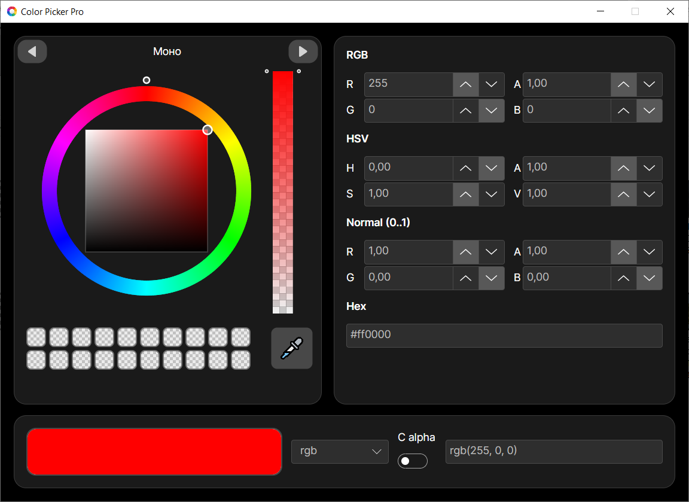
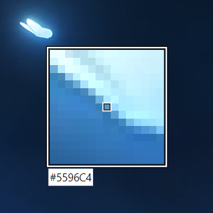

#  Color Picker Pro

**Color Picker Pro** — приложение для выбора, анализа и управления цветом.  
Идеально подходит для дизайнеров, веб-разработчиков и художников.

---

---

## Основные возможности

### 1️⃣ Различные режимы цветовых гармоний

Приложение поддерживает несколько режимов генерации цветовых схем:

- **Контраст** – автоматически подбирает чёрный или белый цвет для максимальной читаемости на выбранном фоне.
- **Триада** – три цвета, расположенные на цветовом круге под углом 120°.
- **Тетрада** – четырёхцветная схема (две комплементарные пары).
- **Аналогия** – соседние цвета на цветовом круге (создаёт мягкую, гармоничную палитру).
- **Акцент анфлогия** - Аналогия + Контраст

> *Каждый сгенерированный цвет можно кликнуть – он станет основным.*

### 2️⃣ Режим пипетки (EyeDropper)

Позволяет **захватить цвет с любого пикселя экрана**:
1. Нажмите на значок пипетки.
2. Наведите курсор на нужное место (лупа покажет увеличенную область).
3. Кликните – цвет будет мгновенно определён и отобразится во всех форматах.

### 3️⃣ Сохранение цветов

- Добавляйте понравившиеся цвета в **библиотеку**.
- Быстрый доступ к сохранённым цветам в любой момент.

### 4️⃣ Полная синхронизация с палитрой

Все способы ввода **автоматически синхронизированы**:

- Ползунки RGB / HSV
- Числовые поля RGB, HSV, Normal (0..1)
- Поле Hex (`#RRGGBB`)
- Визуальный цветовой круг / палитра

> *Измените значение в одном месте – остальные обновятся мгновенно.*

### 5️⃣ Выбор формата копирования

Вы можете скопировать текущий цвет в одном из следующих форматов:

| Формат           | Пример вывода                     |
|------------------|-----------------------------------|
| **RGB**          | `rgb(255, 0, 0)`                  |
| **RGB + alpha**  | `rgba(255, 0, 0, 0.5)`            |
| **HSV**          | `0, 100%, 100%`                   |
| **Normal (0..1)**| `1.00, 0.00, 0.00`                |
| **Hex**          | `#ff0000`                         |

Настройте желаемый формат в меню – копирование будет происходить по одной кнопке.
